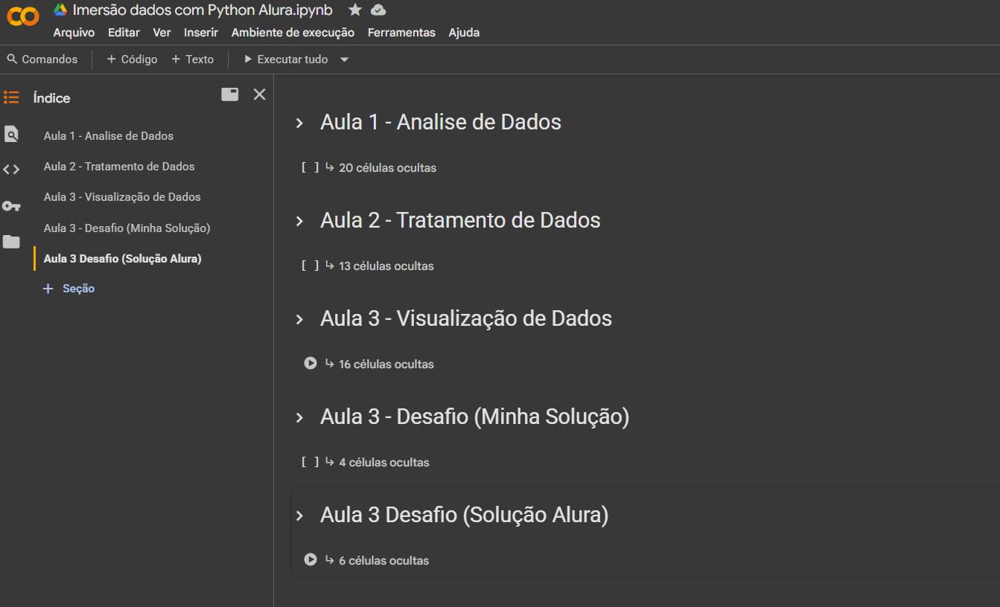
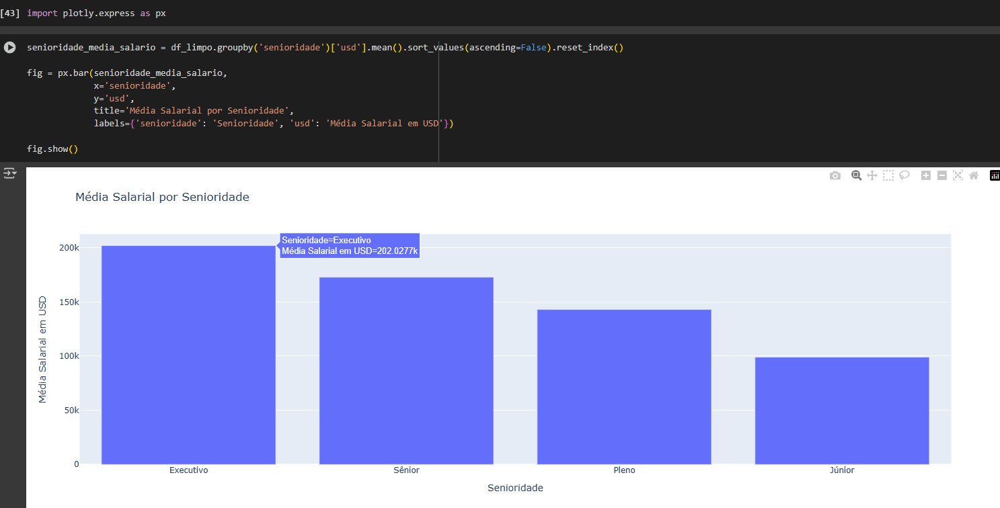
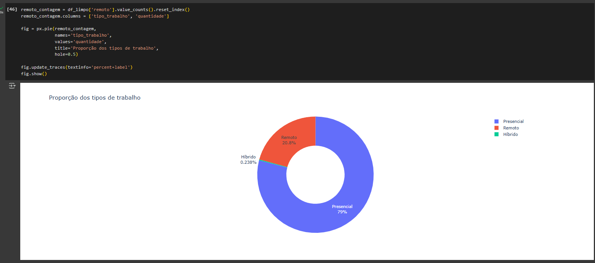
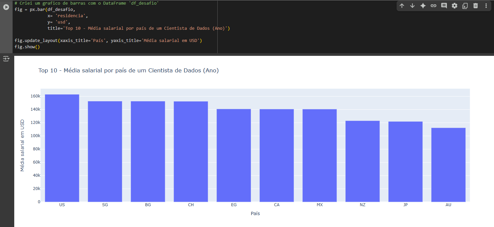
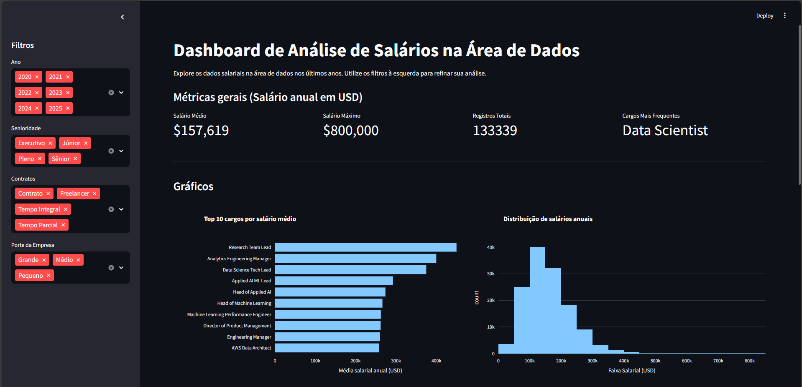
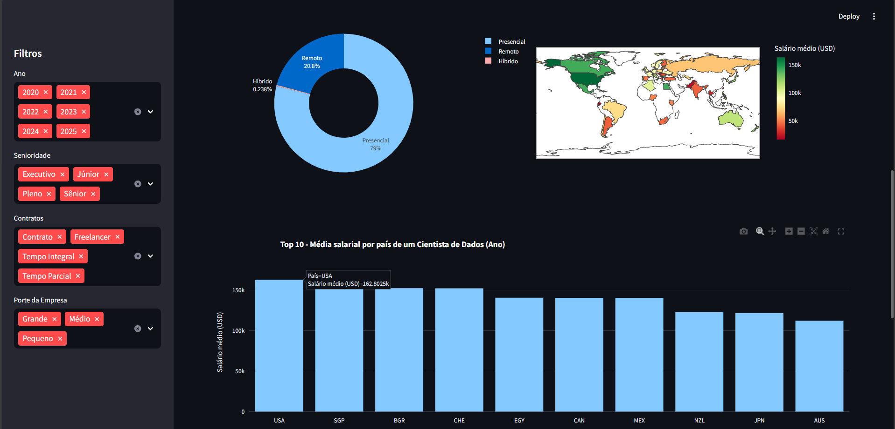

# 📊 Imersão Dados com Python - Alura

Repositório com análises, visualizações e códigos desenvolvidos durante a **Imersão Dados com Python** da **Alura**.

## 📂 Conteúdo
- Notebooks (`.ipynb`) com soluções e análises
- Uso de bibliotecas como:
  - **Pandas** → manipulação e análise de dados
  - **Matplotlib**, **Seaborn** e **Plotly** → visualização gráfica
  - **Streamlit** → criação de Dashboards
  - **PyCountry** → tranformar as siglas dos países de ISO-2 para a ISO-3
- Exercícios, desafios e insights gerados a partir dos dados fornecidos na imersão

## 🎯 Objetivo
Consolidar conhecimentos de **ciência de dados**, explorando e interpretando um banco de dados de pessoas na area de tecnologia por meio de **Python** e suas bibliotecas.

## 🚀 Tecnologias utilizadas
- Python 3.x
- Pandas
- Matplotlib
- Seaborn
- Plotly
- Streamlit
- Pycountry

## ✅ Resultados
- O Notebook ficou dividido assim:

- Houveram graficos com o Matplotlib:

- Graficos Interativos com o Plotly

- Houve um desafio na aula 3 para criar uma visualização de média salarial por pais para o cargo de 'Data Scientist'
  - Minha solução foi criar um top 10 em graficos de barras para que não ficasse uma visualização poluida no grafico:
  
  - Os instrutores da **Alura** apresentaram o incrivel grafico de Mapa com o Plotly:
  

- Foi criado tambem um Dashboard no Streamlit na qual pode ser acessado pelo link: [Dashboard](https://cmsjr-imersao-dados.streamlit.app/)
  
  

---
📌 Desenvolvido durante a [Imersão Dados com Python - Alura](https://cursos.alura.com.br/imersoes)
